# NSE Order-Book/OI Signal Pipeline — Living Project Plan

This document mirrors the approved architecture plan and tracks implementation status.
Authoritative decisions live in [MASTER_REFERENCE.md](MASTER_REFERENCE.md) — if anything here conflicts, MASTER wins.

## Current status: Fast-track Parts 1–8 implemented (full-scale backfill gated)

Implemented in this pass (on top of Stages 0–3A):

- Part 1: `scripts/07_backfill_historical.py` — estimate / probe / execute into
  Stage 1H compacted layout with `source=historical`. **Full-scale execute is
  gated** until the minute-vs-daily request estimate is confirmed.
- Part 2: Stage 2 feature job is source-aware (`historical_partial` vs `live_full`);
  depth features are skipped, not null-filled, on historical OHLCV.
- Part 3: labels accept date ranges; vol warmup from prior compacted days.
- Part 4: `scripts/06_run_baseline.py` YAML scorer → `signal_log`.
- Part 5: reusable walk-forward harness `scripts/08_run_backtest.py`.
- Part 6: coarse+fine logistic + Markov + registry; models must pass the
  Part 5 harness before live load (`scripts/09_train_models.py`).
- Part 7: live scorer `scripts/10_run_live_signals.py` with **pooled** maturity
  gate (cumulative live days per class, Nifty weekly vs Bank Nifty monthly separate).
- Part 8: `scripts/11_run_retrain.py` versioned retrain, no overwrite, no auto-promote.

Out of scope (unchanged): Stages 7–9, equity options, single-stock futures,
**Nifty monthly options** (see TRADE_OFFS.md).

Daily: auth → ingest → after close compact (`03`) → features (`04`) → labels (`05`).
Historical backfill is a one-time / incremental job (`07`), not the daily path.

Do not reopen Stage 1 ingestion.

## Your review gate (Stage 1)

Before Stage 1G / Stage 2, verify:

1. `python scripts/00_kite_auth.py` succeeds (profile + quote + instrument cache)
2. `python scripts/01_run_ingestion.py` during market hours produces Parquet under `data/raw/`
3. `python scripts/02_run_backfill.py` produces `candles.parquet` per symbol
4. `python scripts/inspect_data.py` shows sensible timestamps/columns (full schema dumps for equity/option/index)
5. SQLite `ingestion_meta` shows connect/flush/shutdown events
6. `NIFTY 50` spot is subscribed and writing under `data/raw/{date}/NIFTY 50/`

## Architecture reference

```mermaid
flowchart LR
  Stage1[Stage1_Ingestion_pilot] --> Stage1G[Stage1G_Universe]
  Stage1G --> Stage1H[Stage1H_Compact_DuckDB]
  Stage1H --> Stage2[Stage2_Features_DQ]
  Stage2 --> Stage3[Stage3_LabelsBaseline]
  Stage3 --> Stage4[Stage4_Backtest]
  Stage4 --> Stage5[Stage5_Phase2Models]
  Stage5 --> Stage6[Stage6_LiveSignals]
  Stage6 --> Stage7[Stage7_AccountCapture]
  Stage7 --> Stage8[Stage8_TradeLinkage]
  Stage8 --> Stage9[Stage9_DecisionQuality]
  Stage9 --> Stage10[Stage10_Dashboard]
  Stage9 --> Stage11[Stage11_Retrain]
```

Stage 1 already stores ticks, 5-level depth, candles, instruments, and SQLite
`feature_log` / `signal_log` / `ingestion_meta`. Remaining Kite account/order
capture from MASTER §2 lands in Stage 7 (Stage 1 is closed — do not reopen).
Universe and storage-query upgrades land in Stage 1G–1H **before** Stage 2 feature work.

## Confirmed universe (Stage 1G onward)

| Bucket | Scope | Kite mode / notes |
|---|---|---|
| Equities — depth | **Nifty 100** constituents (~100) | WebSocket `MODE_FULL` (5-level depth) |
| Equities — quote | **Nifty 500 \\ Nifty 100** (~400) — stocks in Nifty 500 that are **not** already in the depth set | WebSocket `MODE_QUOTE` — **no depth**, **no duplicate tokens** |
| Index options | **Nifty + Bank Nifty** only | ATM ± N from settings; **no equity options** |
| Index futures | **Nifty + Bank Nifty**, near + next month | `MODE_FULL`; expiry/lot size from live instrument master |
| Index spot | **NIFTY 50** + **NIFTY BANK** | Live spot for Greeks / basis |

Explicitly out of scope: equity options, single-stock futures, **Nifty monthly
options** (weekly Nifty only; Bank Nifty monthly is its only series). See
[TRADE_OFFS.md](TRADE_OFFS.md).

### Signal horizon (locked)

Wired in `config/settings.yaml` under `signal:` (not hardcoded in labeling code):

- **Active (Stage 3A):** `label_mode: triple_barrier` — vol-scaled barriers on each
  instrument’s own 5-min return series (options: own premium). Floor/cap via
  `min_threshold_pct` / `max_threshold_pct`. Path rule: close at T+5m vs ±thr.
- **Legacy (comparison only):** flat ±`threshold_pct` (0.15%) next-candle close.
- **Phase B (deferred):** `options_label_mode: delta_residual` — label residual
  after delta-hedge vs underlying; not implemented; keep `raw_premium` for now.

### Session coverage (locked)

- NSE cash bounds in `session:` (`09:15`–`15:30` IST, ±grace minutes).
- Compaction / features / labeling assess first/last compacted tick span and
  **flag `coverage=partial`** (late start and/or early end) in stdout +
  `ingestion_meta` (`event_type=session_coverage`) + label report JSON.
- Partial days still run the normal daily pipeline; they must **not** be treated
  as full open-to-close equivalents in later analysis.
- **Pending:** hourly legacy vs TBM up/down/flat comparison — only after a
  **full** session is captured (skipped for `2026-08-13` partial midday slice).

### Nifty 100 / 500 membership refresh (locked)

Source: NSE official published constituent CSVs (via NSE archives / Nifty Indices mirrors), e.g.:

- `https://archives.nseindia.com/content/indices/ind_nifty100list.csv`
- `https://archives.nseindia.com/content/indices/ind_nifty500list.csv`

**How refresh is triggered (not a one-time hardcoded list):**

1. **Every instrument-cache rebuild** — `scripts/00_kite_auth.py` (interactive login **and** `--refresh-cache`) downloads fresh CSVs, then resolves Kite tokens.
2. **Stale-on-startup** — when ingestion starts, if the on-disk membership snapshot is older than `universe.membership_max_age_days` (default 7), refresh CSVs before subscribe.
3. **Manual / scheduled** — `python scripts/00_kite_auth.py --refresh-cache` (or a Task Scheduler weekly job calling the same path) after index rebalances.

Quote-mode set is always computed as `set(Nifty500) - set(Nifty100)` after each refresh so overlap cannot accumulate.

## Open decisions (still needed from you)

1. **Option chain width** — default ATM ±10 strikes for Nifty and Bank Nifty (configurable in `settings.yaml`)
2. **Reference code** — OFI, greeks.py, Phase 1 formulas (placeholders wired for now)

---

## Future stages (not started)

Work strictly in order after the Stage 1 review gate.

### Stage 1G — Universe expansion (2–3 sessions)

Reconfigure subscription + instrument cache away from the Stage 1 pilot
(3 equities + Nifty options only). Do **not** reopen Stage 1 code paths as a
rewrite — extend resolver, settings, and subscribe lists.

**1G-A — Config + membership**
- Settings for: Nifty 100 depth, Nifty 500\\Nifty 100 quote, Nifty/Bank Nifty
  options + futures (near+next), spot indices, locked `signal:` horizon
- NSE constituent CSV URLs + `membership_max_age_days` in settings
- Drop any path that would subscribe equity options
- Document token-count / rate limits for the expanded WebSocket set

**1G-B — Instrument resolver**
- Download NSE Nifty 100 + Nifty 500 CSVs on refresh; compute
  `quote_symbols = nifty500 - nifty100` (no overlap)
- Resolve equity tokens from live Kite NSE master
- Nifty + Bank Nifty option chains (ATM ± N, live expiry — never hardcoded)
- Nifty + Bank Nifty futures: near + next month (live expiry/lot size)
- Spot: NIFTY 50 + NIFTY BANK under cache `index`
- Lot size / expiry / strike always from Kite `instruments()` — never hardcoded

**1G-C — Dual-mode WebSocket subscription**
- Depth set (`MODE_FULL`): Nifty 100 + options + futures + index spots
- Quote set (`MODE_QUOTE`): Nifty 500 \\ Nifty 100 only — never also FULL
- Backfill path covers the same universe (candles + OI where applicable)
- Gate: cache reports counts; assert zero token overlap between modes;
  `inspect_data` can sample one depth equity, one quote equity, one option,
  one future, one spot

### Stage 1H — Daily compaction + DuckDB query layer (2 sessions)

Must complete before Stage 2 feature jobs read multi-file tick dumps.

**1H-A — After-close compaction**
- Merge per-minute `ticks_*.parquet` into **one file per symbol per day**
  (e.g. `data/raw/{date}/{symbol}/ticks.parquet` or `data/compacted/...`)
- Idempotent; safe to re-run; leave or archive minute files per config
- Script + runbook step after market close (Task Scheduler later)

**1H-B — DuckDB query layer**
- DuckDB as read layer over compacted Parquet (views or thin Python helpers)
- Stage 2+ feature jobs query via DuckDB, not ad-hoc multi-file pandas globs
- Document partition layout + example queries in README

### Stage 2 — Feature engineering (4–5 sessions)

**2A — Equity features**
- Bid/ask depth ratio, spread (absolute + bps) — depth universe (Nifty 100)
- Quote-only path for Nifty 500 (spread/LTP/volume features without depth/OFI)
- OFI stub with formula interface documented (depth names only)
- VWAP deviation from session-start cumulative ticks

**2B — Options features** (Nifty + Bank Nifty index options only)
- OI buildup classifier (4 states) on 5-min buckets
- PCR with buildup direction context
- Greeks wrapper stub calling placeholder `greeks.py` interface (spot from live index)

**2C — Futures basis features** (Nifty + Bank Nifty, near + next)
- Futures vs spot basis (absolute + bps / annualized as configured)
- Near vs next calendar/spread basis
- Futures OI / volume context alongside basis
- Align timestamps to equity/option feature buckets for joint rows

**2D — Data-quality gate**
- Bad-tick filtering (stale timestamps, crossed book, impossible jumps, null/zero LTP rules)
- Live expiry + lot-size lookup from instrument master — **never hardcoded**
- `stock_quote_freeze` logging for per-symbol unchanged LTP+volume runs
  (possible individual price-band / quote freeze — **not** market-wide NSE
  circuit breaker); distinct from WebSocket disconnects
- Gate runs before feature writes; rejected ticks counted/logged, not silently dropped without audit
- Jump filter: equity/futures/index `max_tick_return_pct` (5%); options use separate
  `options_max_tick_return_pct` (25%) until moneyness/IV-aware scaling exists

**2E — Batch job**
- `scripts/04_run_features.py`: read compacted day via DuckDB → write `feature_log`
  (`03_run_compaction.py` is Stage 1H)
- Idempotent (re-run same day replaces or upserts)
- Applies 2D quality gate; emits equity / options / futures feature rows

### Stage 3 — Outcome labeling + baseline scorer (2 sessions)

**3A — Outcome labels** (horizon locked in settings)
- Default: Triple-Barrier Method — thr = realized_vol × `barrier_multiplier`,
  clipped to `[min_threshold_pct, max_threshold_pct]`; label from close at
  T+`candle_interval_minutes` vs ±thr → up(+1)/down(−1)/flat(0)
- Own-series vol (EWMA / rolling_std); options use premium returns, not underlying
- `scripts/05_run_labels.py`: write `feature_log.actual_outcome` + `label_audit`;
  **always** reports floor/cap binding rates (incl. `missing_vol` vs `below_min`)
- Hourly legacy vs TBM label mix: **pending** until `coverage=full`
  (`hourly_compare_status=pending_full_session` on partial days)
- Phase B hook: `options_label_mode: delta_residual` (documented, not built)

**3A evidence (2026-08-13 — PARTIAL coverage)**
- Tick span ~11:55–12:06 IST → `late_start` + `early_end`; not a full session
- Floor binding: **100%** of TBM labels (`n=1176`); all `missing_vol` (series too
  short for `vol_min_periods`); cap **0%**; dynamic **0%**
- Hourly legacy vs TBM comparison: **deferred** (pending full open-to-close day)

**3B — Phase 1 baseline model**
- YAML-driven linear scoring rule (placeholder weights)
- Write scores to `signal_log` for historical replay

### Stage 4 — Backtesting (2 sessions)

**4A — Walk-forward framework**
- Rolling train/test windows per config
- Strict temporal split enforcement

**4B — Costs + metrics**
- Apply brokerage, STT, slippage per trade
- Report in-sample vs out-of-sample: hit rate, avg P&L/trade, Sharpe, max drawdown
- Flag overfitting if IS/OOS diverge beyond threshold

### Stage 5 — Phase 2 models (3 sessions)

**5A — Logistic regression (equity + options + futures-aware tracks)**
- sklearn `LogisticRegression`, standardized features
- Save joblib with timestamp + metadata JSON

**5B — Markov OI model**
- Estimate 4×4 transition matrix from historical OI states
- Emit state probability vector alongside logistic score

**5C — Model registry**
- `load_latest_model()` abstraction for signal engine

### Stage 6 — Live signal engine (2 sessions)

**6A — Real-time feature compute**
- Incremental OFI/VWAP/OI/basis state (not full-day replay)
- Load latest model, score every tick or every N seconds (config)
- Dual-mode feed aware (depth vs quote symbols)

**6B — Signal logging**
- Write to `signal_log` with feature snapshot JSON
- Decoupled from Streamlit

**6C — Ops health (parked from Stage 1G ops note)**
- Simple "did ingestion run today?" check (folder/meta presence under
  `data/raw/{today}`) — ingestion currently needs a manual morning start;
  not urgent, wire here or as a small pre-market script later

### Stage 7 — Extended Kite account capture (2 sessions)

Stage 1 already covers live ticks/depth, candles, and instruments. This stage
adds account/order ground truth required for later decision review (MASTER §2).

**7A — Orders + fills**
- SQLite: `order_events` (placed/modified/executed/cancelled/rejected via
  WebSocket order postback and/or `orders()`)
- SQLite: `trade_fills` from `trades()` — actual price/qty/time (ground truth
  for Stage 9; not optional)
- Capture path wired into market-hours runbook alongside ingestion

**7B — Account snapshots**
- `positions_snapshot` — poll `positions()` periodically during market hours
- `holdings_snapshot` — daily `holdings()`
- `margin_snapshot` — poll `margins()` (available/used/SPAN+exposure)
- `gtt_log` deferred unless GTTs are actually used
- Profile/funds once per session as low-priority audit trail

### Stage 8 — Recommendation ↔ action ↔ outcome linkage (2 sessions)

Every trade must be traceable through three linked records via shared `trade_id`
(MASTER §3):

1. `decision_log` — what was recommended (or done manually) and why
2. `trade_fills` — what actually executed on Kite
3. `outcome_log` — post-entry/post-exit market state + decision-quality scores

**8A — `decision_log`**
- Strike rationale, sizing rationale (incl. Kelly-fraction comparison fields),
  timing rationale (IV rank + OI/PCR context at entry — schema fields even if
  full IV-history tracking lands later)
- Risk parameters
- Flag: system-suggested | manual | system-suggested-but-overridden

**8B — Link fills to decisions**
- Match `trade_fills` to `decision_log` rows via `trade_id`
- Record fill vs recommended divergence (price/qty/time)
- Signal engine and any manual-log path must mint/attach `trade_id`

**8C — `outcome_log` scaffold**
- Schema for post-entry/post-exit market checkpoints and decision-quality
  fields (populated in Stage 9)

### Stage 9 — Entry/exit decision-quality algorithm (3 sessions)

Reviews whether entry/exit were *good decisions*, separately from whether they
made money (MASTER §4). For every closed trade (entry+exit pair from
`trade_fills`):

**9A — Checkpoint capture**
- At +5min, +15min, +30min, and end-of-day relative to both entry and exit
  timestamps: store price, IV, and OI state

**9B — Entry quality score**
- Compare the model's stated probability/confidence at entry against what a
  well-calibrated model should have believed given **only information available
  at that moment**
- **Anti-hindsight rule (do not lose this):** do **not** score against the
  full-hindsight objectively best entry — that target is unlearnable and
  teaches noise-chasing

**9C — Exit quality + 2×2 classification**
- Favorable price/IV continuation after exit → exited early; reversal after
  exit → exit was well timed (same fixed checkpoints for comparability)
- Classify every trade: Good decision/Good outcome, Good decision/Bad outcome
  (bad luck — do not punish in retrain), Bad decision/Good outcome (lucky —
  do not reward in retrain), Bad decision/Bad outcome
- This classification — not raw P&L — feeds Stage 11 retraining

**9D — Personal behavior aggregates**
- Roll up system/manual/overridden flag from `decision_log` against quality
  scores over time (does manual judgment add or subtract vs the model?)

### Stage 10 — Streamlit dashboard (2 sessions)

Formerly Stage 7. Dashboard comes after decision-quality exists so it can
display that history.

**10A — Core panels**
- Per symbol: price, plain-English features ("Long Buildup at 24500 CE"),
  probability
- Auto-refresh from SQLite (5s poll)
- Signal engine remains source of truth; Streamlit reads only from SQLite

**10B — Rolling accuracy + decision-quality history**
- Compare recent signals to realized outcomes
- Highlight drift vs backtest expectations
- Decision-quality history from `outcome_log` / Stage 9 scores (2×2 class,
  entry/exit quality, system vs manual vs overridden)

### Stage 11 — Retrain loop (1 session)

Formerly Stage 8.

**11A — Scheduled retrain**
- `scripts/06_run_retrain.py`: weekly rolling window retrain
- Log model version, IS/OOS metrics, live accuracy comparison
- Feedback target: Stage 9 2×2 classification — do not reward lucky bad
  decisions or punish unlucky good ones via raw P&L alone
- Windows Task Scheduler / cron instructions in README

---

## Deferred (not numbered stages yet)

From MASTER strategic pivot — designed, not yet built as separate stages:

- Full `iv_history` table + IV rank/percentile / vol risk premium tracking
- Hedge-structure payoff engine (credit spreads + iron condors)
- Equity options / single-stock F&O (explicitly out of current universe)

Stage 8–9 schema fields may reserve IV-rank context hooks; the full IV and
payoff components wait until explicitly scheduled.
