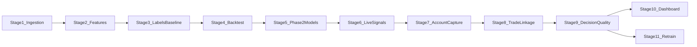

# NSE Order-Book/OI Signal Pipeline — Living Project Plan

This document mirrors the approved architecture plan and tracks implementation status.
Authoritative decisions live in [MASTER_REFERENCE.md](MASTER_REFERENCE.md) — if anything here conflicts, MASTER wins.

## Current status: Stage 1 complete (pending your live data review)

Implemented:

- Stage 0A: Project scaffold, config loader, dependencies
- Stage 0B: Kite auth script + README setup guide
- Stage 1A: SQLite schemas + buffered Parquet writer + tests
- Stage 1B: Instrument resolver (equities + NIFTY weekly options)
- Stage 1C–1E: WebSocket ingestion, reconnect, historical backfill
- Stage 1F: `scripts/inspect_data.py` verification helper

Not started (by design — stop after Stage 1):

- Stage 2–6: Feature engineering, labels/baseline, backtest, Phase 2 models, live signal engine
- Stage 7–9: Extended Kite account capture, decision/fill/outcome linkage, decision-quality algorithm
- Stage 10–11: Dashboard, weekly retrain loop

## Your review gate (Stage 1)

Before Stage 2, verify:

1. `python scripts/00_kite_auth.py` succeeds (profile + quote + instrument cache)
2. `python scripts/01_run_ingestion.py` during market hours produces Parquet under `data/raw/`
3. `python scripts/02_run_backfill.py` produces `candles.parquet` per symbol
4. `python scripts/inspect_data.py` shows sensible timestamps/columns
5. SQLite `ingestion_meta` shows connect/flush/shutdown events

## Architecture reference

Stage 1 already stores ticks, 5-level depth, candles, instruments, and SQLite
`feature_log` / `signal_log` / `ingestion_meta`. Remaining Kite account/order
capture from MASTER §2 lands in Stage 7 (Stage 1 is closed — do not reopen).

## Open decisions (still needed from you)

1. **Custom signal horizon** — before Stage 3 outcome labeling
2. **Option chain width** — default ATM ±10 strikes (configurable in `settings.yaml`)
3. **Reference code** — OFI, greeks.py, Phase 1 formulas (placeholders wired for now)

---

## Future stages (not started)

Work strictly in order after the Stage 1 review gate.

### Stage 2 — Feature engineering (3 sessions)

**2A — Equity features**
- Bid/ask depth ratio, spread (absolute + bps)
- OFI stub with formula interface documented
- VWAP deviation from session-start cumulative ticks

**2B — Options features**
- OI buildup classifier (4 states) on 5-min buckets
- PCR with buildup direction context
- Greeks wrapper stub calling placeholder `greeks.py` interface

**2C — Batch job**
- `scripts/03_run_features.py`: read day's ticks/candles → write `feature_log`
- Idempotent (re-run same day replaces or upserts)

### Stage 3 — Outcome labeling + baseline scorer (2 sessions)

**3A — Outcome labels** (requires your signal horizon)
- Forward-return labeler on feature timestamps
- Populate `feature_log.actual_outcome` retrospectively

**3B — Phase 1 baseline model**
- YAML-driven linear scoring rule (placeholder weights)
- Write scores to `signal_log` for historical replay

### Stage 4 — Backtesting (2 sessions)

**4A — Walk-forward framework**
- Rolling train/test windows per config
- Strict temporal split enforcement

**4B — Costs + metrics**
- Apply brokerage, STT, slippage per trade
- Report in-sample vs out-of-sample: hit rate, avg P&L/trade, Sharpe, max drawdown
- Flag overfitting if IS/OOS diverge beyond threshold

### Stage 5 — Phase 2 models (3 sessions)

**5A — Logistic regression (equity + options tracks)**
- sklearn `LogisticRegression`, standardized features
- Save joblib with timestamp + metadata JSON

**5B — Markov OI model**
- Estimate 4×4 transition matrix from historical OI states
- Emit state probability vector alongside logistic score

**5C — Model registry**
- `load_latest_model()` abstraction for signal engine

### Stage 6 — Live signal engine (2 sessions)

**6A — Real-time feature compute**
- Incremental OFI/VWAP/OI state (not full-day replay)
- Load latest model, score every tick or every N seconds (config)

**6B — Signal logging**
- Write to `signal_log` with feature snapshot JSON
- Decoupled from Streamlit

### Stage 7 — Extended Kite account capture (2 sessions)

Stage 1 already covers live ticks/depth, candles, and instruments. This stage
adds account/order ground truth required for later decision review (MASTER §2).

**7A — Orders + fills**
- SQLite: `order_events` (placed/modified/executed/cancelled/rejected via
  WebSocket order postback and/or `orders()`)
- SQLite: `trade_fills` from `trades()` — actual price/qty/time (ground truth
  for Stage 9; not optional)
- Capture path wired into market-hours runbook alongside ingestion

**7B — Account snapshots**
- `positions_snapshot` — poll `positions()` periodically during market hours
- `holdings_snapshot` — daily `holdings()`
- `margin_snapshot` — poll `margins()` (available/used/SPAN+exposure)
- `gtt_log` deferred unless GTTs are actually used
- Profile/funds once per session as low-priority audit trail

### Stage 8 — Recommendation ↔ action ↔ outcome linkage (2 sessions)

Every trade must be traceable through three linked records via shared `trade_id`
(MASTER §3):

1. `decision_log` — what was recommended (or done manually) and why
2. `trade_fills` — what actually executed on Kite
3. `outcome_log` — post-entry/post-exit market state + decision-quality scores

**8A — `decision_log`**
- Strike rationale, sizing rationale (incl. Kelly-fraction comparison fields),
  timing rationale (IV rank + OI/PCR context at entry — schema fields even if
  full IV-history tracking lands later)
- Risk parameters
- Flag: system-suggested | manual | system-suggested-but-overridden

**8B — Link fills to decisions**
- Match `trade_fills` to `decision_log` rows via `trade_id`
- Record fill vs recommended divergence (price/qty/time)
- Signal engine and any manual-log path must mint/attach `trade_id`

**8C — `outcome_log` scaffold**
- Schema for post-entry/post-exit market checkpoints and decision-quality
  fields (populated in Stage 9)

### Stage 9 — Entry/exit decision-quality algorithm (3 sessions)

Reviews whether entry/exit were *good decisions*, separately from whether they
made money (MASTER §4). For every closed trade (entry+exit pair from
`trade_fills`):

**9A — Checkpoint capture**
- At +5min, +15min, +30min, and end-of-day relative to both entry and exit
  timestamps: store price, IV, and OI state

**9B — Entry quality score**
- Compare the model's stated probability/confidence at entry against what a
  well-calibrated model should have believed given **only information available
  at that moment**
- **Anti-hindsight rule (do not lose this):** do **not** score against the
  full-hindsight objectively best entry — that target is unlearnable and
  teaches noise-chasing

**9C — Exit quality + 2×2 classification**
- Favorable price/IV continuation after exit → exited early; reversal after
  exit → exit was well timed (same fixed checkpoints for comparability)
- Classify every trade: Good decision/Good outcome, Good decision/Bad outcome
  (bad luck — do not punish in retrain), Bad decision/Good outcome (lucky —
  do not reward in retrain), Bad decision/Bad outcome
- This classification — not raw P&L — feeds Stage 11 retraining

**9D — Personal behavior aggregates**
- Roll up system/manual/overridden flag from `decision_log` against quality
  scores over time (does manual judgment add or subtract vs the model?)

### Stage 10 — Streamlit dashboard (2 sessions)

Formerly Stage 7. Dashboard comes after decision-quality exists so it can
display that history.

**10A — Core panels**
- Per symbol: price, plain-English features ("Long Buildup at 24500 CE"),
  probability
- Auto-refresh from SQLite (5s poll)
- Signal engine remains source of truth; Streamlit reads only from SQLite

**10B — Rolling accuracy + decision-quality history**
- Compare recent signals to realized outcomes
- Highlight drift vs backtest expectations
- Decision-quality history from `outcome_log` / Stage 9 scores (2×2 class,
  entry/exit quality, system vs manual vs overridden)

### Stage 11 — Retrain loop (1 session)

Formerly Stage 8.

**11A — Scheduled retrain**
- `scripts/06_run_retrain.py`: weekly rolling window retrain
- Log model version, IS/OOS metrics, live accuracy comparison
- Feedback target: Stage 9 2×2 classification — do not reward lucky bad
  decisions or punish unlucky good ones via raw P&L alone
- Windows Task Scheduler / cron instructions in README

---

## Deferred (not numbered stages yet)

From MASTER strategic pivot — designed, not yet built as separate stages:

- Full `iv_history` table + IV rank/percentile / vol risk premium tracking
- Hedge-structure payoff engine (credit spreads + iron condors)

Stage 8–9 schema fields may reserve IV-rank context hooks; the full IV and
payoff components wait until explicitly scheduled.
